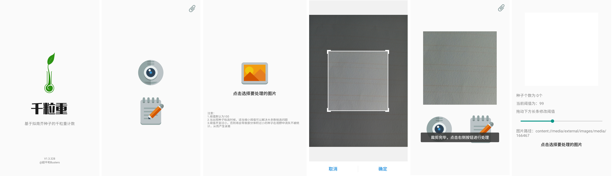

	

## Camera

### A software for counting arabidopsis seeds.

### 🌈 Demo

### 🛵 Platform

- Android 4.0.0+.

- Developed by Android Studio.

### ✍ Algorithm

- [Corrosivity Classification Schemes](https://blog.csdn.net/li_wen01/article/details/72867057)

### 🔨 Usage

- Build APP
  
  - Import it in Android Studio as a project.

  - Update and sync the necessary module.
- Use App
  - Take a photo of your seed on a white paper that does not produce shadows.
  - App will recommend a suitable threshold for you, you can adjust it manually.
  - Check the result.

### 🎤 Others

- Its architecture is very simple and we focused on algorithm application.
- Developed by Group [Tianyu Zhang](https://ztygalaxy.github.io) \ Song Gao \ Weiying Wang in 2017.
- First Vision: 2017 v1.3.328
- It was supported by 2016 National Student Research & Training Plan.

#### 📜  Memo

- Threshold will be setting automatically by OTSU algorithm based genetic algorithm in the next version.

- If you have any better idea, please [connect](mailto:tyzhang@hdu.edu.cn) me.